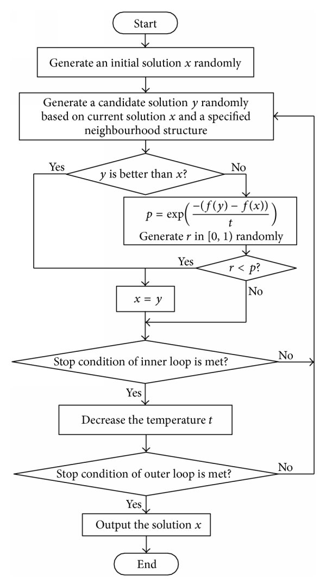

# Thesis Project
## scheduling-with-annealing-simulation-algorithm

```
Workshop type scheduling has been made to reduce the number of machines and cmax for a busy production 
site of a corporate company. 
```

### Project description
```
The classic Workshop Scheduling (ATC) problem is the process of working on a machine cluster.

it's about sorting. Flexible WorkshocScheduling (EATC) problem, The constraint that an operation can be processed on a machine in the problem of 
It is an expanded version due to its machinability on the machine. 
EATC In the problem, each operation of each job can be 
processed on at least one machine. in question.
In other words, there is an alternative machine selection for each operation (Kaya and Fığlalı, 2016).


```
### Flow Chart of Annealing Simulated Algorithm


<center></center>

# SUGGESTED SOLUTION APPROACH

```
Initial solution is heuristic and general algorithm is metaheuristic

```

```
Input data: 𝑇𝑑𝑒𝑟𝑒𝑐𝑒0, 𝑇𝑑𝑒𝑟𝑒𝑐𝑒𝑠𝑜𝑛, Initial solution, N, cancel
cancel=0
Solution= Initial solution
N = number of cycles desired for a temperature
Best solution= Initial solution
Tdegree=𝑇𝑑𝑒𝑟𝑒𝑐𝑒𝑠𝑜𝑛
While T>𝑇𝑑𝑒𝑟𝑒𝑐𝑒0
I=1
counter=0
While Counter<N
If makespan> overtime or length(smatrix)=0
 I=I+1
 end if
While I=1 or I=5 or I=9 or I=13
Solution2= solution created with a neighborhood structure
If objective1(solution2)> objective1(best solution)
best solution=solution
Elseif objective1(solution2)= objective1(best solution)
If objective2(solution2)< objective2(best solution)
 best solution=solution2
end if
end if
If objective1(solution2) > objective1(solution)
 solution=solution2
 Elseif objective1(solution2) < objective1(solution)
I=I+1
If R< exp(-(goal1(solution) – objective1(solution2))/Tdegree)
 solution2=solution
end if
 Elseif goal1(solution2) =goal1(solution)
 I=I+1
 If objective2(solution2) < objective2(solution)
 solution=solution2
 elseif objective2(solution2) > objective2(solution)
 if R< exp(-(object2(solution2) -object2(solution))/Tdegree)
 solution=solution2
 end if
 elseif objective2(solution2) = objective2(solution)
 if R<0.5
 solution=solution2
 end if
 end if
end if
end while
While I=2 or I=6 or I=10 or I=14
Solution2= solution created by neighborhood two structure
If objective2(solution2)< objective2(Best solution)
best solution=solution2
end if
If objective2(solution2) < objective2(solution)
solution=solution2
elseif objective2(solution2) > objective2(solution)
I=I+1
if R< exp(-(object2(solution2) - objective2(solution))/Tdegree)
solution=solution2
end if
elseif objective2(solution2) = objective2(solution)
I=I+1
if R<0.5
solution=solution2
end if
end if
end while
If cancel=1 or length(zmatrix)=0
I=I+1
end if
While I=3 or I=7 or I=11 or I=15
Solution2= solution created by neighborhood three structure
If objective2(solution2)< objective2(best solution)
best solution=solution2
end if
If objective2(solution2) < objective2(solution)
solution=solution2
elseif objective2(solution2) > objective2(solution)
I=I+1
if R< exp(-(object2(solution2) - objective2(solution))/Tdegree)
solution=solution2
end if
elseif objective2(solution2) = objective2(solution)
I=I+1
if R<0.5
solution=solution2
end if
end if
end while
If maxpen<overtime or length(smatrix)=0
I=I+1
end if
While I=4 or I=8 or I=12 or I=16
Solution2= solution created with neighborhood four structure
If objective2(solution2)< objective2(best solution)
best solution=solution2
end if
If objective2(solution2) < objective2(solution)
solution=solution2
elseif objective2(solution2) > objective2(solution)
I=I+1
if R< exp(-(object2(solution2) - objective2(solution))/Tdegree)
solution=solution2
end if
elseif objective2(solution2) = objective2(solution)
I=I+1
if R<0.5
solution=solution2
end if
end if
end while
counter=counter+1
end while
Tdegree=Tdegree-cooling
end while
```
# Results
```
Developed Algorithm has been implemented in MATLAB 9.4 version, and it has a 16-bit operating system with 2.70 Ghz Intel 7th generation operating system. 
It is run on a computer with GB of RAM. To measure the algorithm proposed in this study, Fattahi et al. (2007) 20 problems created by him were solved.
```


```
In the table, in the second column n is the number of jobs, 
h m represents the maximum number of machines that an operation can be processed among all operations, 
and m represents the number of machines. In the third column, suggested lower(ES) and upper(EXP) limits are given for each problem. 
The fourth column shows the completion time of the last operation of the lowest, last completed job that the algorithm (al orithma1) developed by Yazdani et al (2009) found for each problem.

When the table is examined, it is seen that the proposed algorithm is much better than other algorithms.
```
