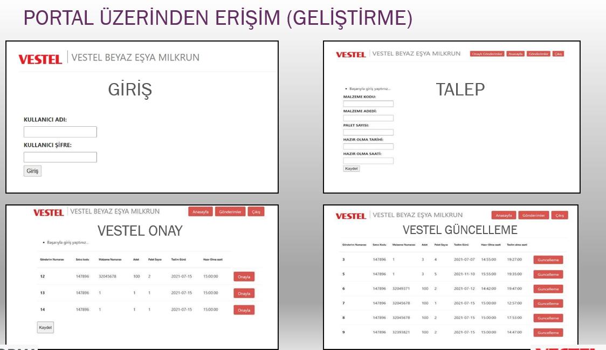

# Vestel Milkrun Site

## Project Purpose

```
milkrun system created to regulate the daily material flow to the factory and to minimize the cost
```
## Technical Design
```
Mysql was used as the database built on the system flask.
```
## System Description
```
There are 2 types of users in the system:

first: suppliers
The suppliers enter the product's readiness information into the system, for example, they enter the information on which product to send and how many pallets on which day they will be sent to the system, and the factory can revise the delivery until it approves this delivery.

second: factory
The factory examines and approves the deliveries entered into the system by the suppliers, and also enters the information that the delivery will be received thanks to the artificial intelligence-based vehicle routing system working at the back.
```


## used tech


